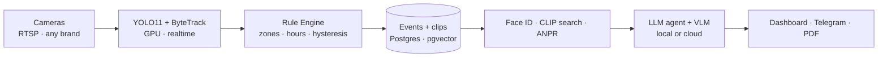

# Pragmata AI — AI Security Copilot

> **«Ask your camera»** — an AI analyst that runs on top of your *existing* cameras (any brand, any RTSP). It watches on its own, alerts instantly, answers questions in Uzbek and Russian, and finds a person by description in seconds.

**🌐 Language:** **English** · [Русский](README.ru.md) · [O'zbekcha](README.uz.md)

Built for **President AI Award 2026** (awards.gov.uz). Deadlines: early bird **2026-08-15**, final **2026-09-30**.

`Python 3.12` · `FastAPI` · `Postgres + pgvector` · `YOLO11` · `InsightFace` · `React 19` · strict CI (`ruff` · `mypy --strict` · 90+ tests)

---

## What it is

Millions of cameras in Uzbekistan **record but nobody watches**. One guard cannot follow 30–40 screens; after an incident it takes hours of manual scrubbing. Pragmata is a **copilot layer** over hardware that is already installed — no camera replacement, no vendor lock-in. It automates **not the cameras, but the decisions**.

The whole AI stack can run **fully on-prem** — video, faces and plates never leave the site, and the LLM/vision models run locally, so it works with the internet switched off. This is the answer to the main question banks and government sites ask.

## Key capabilities

- **Configurable analytics catalog — 19 modules**, toggled per camera/zone: zone intrusion, loitering, after-hours presence, weapon, danger zone, abandoned object, **license plates (ANPR)**, illegal parking, crowd, queue, **heatmap**, **face recognition** (named entry/exit journal), visitor count, PPE (helmet/vest), equipment idle, loading zone, hygiene (gloves/cap), fire & smoke, package damage.
- **Ask your camera** — natural-language chat/agent over the video archive in **uz/ru** (`«Kim kirdi 18:00dan keyin?»`) backed by typed, SQL-first tools (no hallucinated SQL).
- **Investigation by description** — `"a man in a white shirt"` → ranked candidates in seconds (CLIP), with an honest *"not found"* instead of the nearest match.
- **Instant alerts** — event card in the web dashboard and Telegram: photo, zone, time, clip.
- **PDF investigation reports**, **evening digest**, **false-positive feedback loop** that tunes thresholds per site.
- **Multi-tenant** with strict data isolation, **real-time detection on GPU**, deployed at **pragmata.uz**.

## Architecture

Event-driven: cheap detection everywhere, expensive AI only on flagged events.



- **Rule Engine** is an explicit, deterministic layer (hysteresis + cooldown + dwell) — not a black box.
- **VLM** (frame description) runs **only** on flagged events, on a rate budget.
- The **agent** never writes raw SQL — it calls typed tools (`search_events`, `person_timeline`, `find_person`, …).

## Tech stack

| Layer | Choice |
|---|---|
| Backend | Python 3.12, FastAPI, **sync** SQLAlchemy 2.0, Alembic |
| Data | Postgres + **pgvector**, ring-buffer clips |
| Vision | YOLO11 / Ultralytics, ByteTrack, **InsightFace**, open_clip (CLIP), **fast-alpr** (ANPR) |
| LLM / VLM | Ollama (local, offline) **or** OpenRouter — one OpenAI-compatible endpoint |
| GPU | torch + onnxruntime-gpu; `compute_device=auto` (falls back to CPU) |
| Frontend | React 19, Vite 7, TypeScript, Tailwind v4, TanStack Query, i18n (uz/ru/en) |
| Delivery | Docker, uv (never pip) |

## Engineering & security

- **Strict CI on every push:** `ruff` (line 99), `mypy --strict`, `pytest` (90+ tests), OpenAPI contract check, golden-set pipeline run.
- **Hardened auth:** argon2id, JWT, TOTP 2FA, per-account brute-force lockout, security headers, audit log.
- **PII encryption** (Fernet) on sensitive fields; **anonymous biometrics** by default with TTL.
- **Tenant isolation** verified by tests — events and stats never cross organizations.

## Quickstart (local dev)

Requires: [uv](https://docs.astral.sh/uv/), Docker, Node 20+. GPU optional (auto-detected).

```bash
# 1. Backend dependencies (uv — NOT pip)
uv sync

# 2. Postgres (pgvector) in Docker
docker compose -f deploy/docker-compose.yml up -d postgres

# 3. Config + database migrations
cp .env.example .env      # set SECRET_KEY, ENCRYPTION_KEY, ADMIN bootstrap
make migrate              # or: ./scripts/dev_stand.sh (generates keys + sample stand)

# 4. Dashboard API  → http://127.0.0.1:8088/docs
make api

# 5. Camera pipeline (detection + rules + events)
make pipeline config=config/dev-multi.yaml

# 6. Web dashboard (dev)  → http://localhost:5175
make front-dev
```

First run downloads the models (YOLO / CLIP / InsightFace / ALPR) into the local cache. Tests: `make test`. Full checks: `make lint typecheck test`.

## Repository layout

```
pragmata/     backend: pipeline, rules, API, services, analytics registry
  ├─ rules/         deterministic Rule Engine
  ├─ perception/    detector, face recognition
  ├─ analytics/     the 19-module catalog
  └─ api/           FastAPI routers, security, schemas
web/          operator dashboard (React 19 + Vite)
backoffice/   platform back-office (separate Vite app)
alembic/      database migrations
config/       camera/site YAML configs
deploy/       docker-compose (postgres · mediamtx · redis · minio)
docs/         design, vision, pitch deck, video script (uz/ru/en)
tests/        pytest suite (+ golden-set)
```

## Documentation

- [docs/DESIGN.ru.md](docs/DESIGN.ru.md) · [docs/DESIGN.uz.md](docs/DESIGN.uz.md) — full design doc
- [docs/VISION.ru.md](docs/VISION.ru.md) · [docs/VISION.uz.md](docs/VISION.uz.md) — vision & roadmap
- [docs/deck/](docs/deck/) — pitch deck (PDF + editable source)

## License & team

Proprietary — see [LICENSE](LICENSE). © 2026 Pragmata AI team (Shoxruh Baxtiyorov, Otabek).
Submitted to **President AI Award 2026**. Live demo: **[pragmata.uz](https://pragmata.uz)**.
