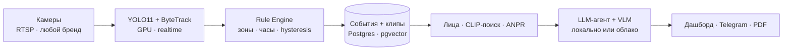

# Pragmata AI — AI Security Copilot

> **«Спроси свою камеру»** — AI-аналитик поверх *уже установленных* камер (любой бренд, любой RTSP). Сам следит, мгновенно сигналит, отвечает на вопросы на узбекском и русском и находит человека по описанию за секунды.

**🌐 Язык:** [English](README.md) · **Русский** · [O'zbekcha](README.uz.md)

Проект для **President AI Award 2026** (awards.gov.uz). Дедлайны: early bird **15.08.2026**, финал **30.09.2026**.

`Python 3.12` · `FastAPI` · `Postgres + pgvector` · `YOLO11` · `InsightFace` · `React 19` · строгий CI (`ruff` · `mypy --strict` · 90+ тестов)

---

## Что это

Миллионы камер в Узбекистане **записывают, но никто не смотрит**. Один охранник не уследит за 30–40 экранами; после инцидента — часы ручной перемотки. Pragmata — это **copilot-слой** поверх уже висящего железа: без замены камер и вендор-лока. Мы автоматизируем **не камеры, а принятие решений**.

Весь AI-стек может работать **полностью на объекте** — видео, лица и номера не покидают периметр, а LLM/vision-модели крутятся локально, поэтому система работает с выключенным интернетом. Это ответ на главный вопрос банков и госсектора.

## Что умеет

- **Настраиваемый каталог аналитики — 19 модулей**, включаются на каждой камере/зоне: вход в зону, задержка, присутствие вне рабочих часов, оружие, опасная зона, оставленный предмет, **автономера (ANPR)**, неправильная парковка, скопление, очередь, **тепловая карта**, **распознавание лиц** (журнал вход/выход по именам), подсчёт посетителей, СИЗ (каска/жилет), простой техники, загрузочная зона, гигиена (перчатки/шапочка), огонь и дым, повреждение упаковки.
- **Спроси свою камеру** — чат/агент на естественном языке по видеоархиву на **uz/ru** (`«Kim kirdi 18:00dan keyin?»`) на типизированных SQL-first инструментах (модель не выдумывает SQL).
- **Поиск по описанию** — `«мужчина в белой рубашке»` → ранжированные кандидаты за секунды (CLIP), с честным *«не найдено»* вместо ближайшего попавшегося.
- **Мгновенные тревоги** — карточка события в веб-дашборде и Telegram: фото, зона, время, клип.
- **PDF-акты расследований**, **вечерний дайджест**, **петля ложных срабатываний** — тюнинг порогов под объект.
- **Мультиарендность** со строгой изоляцией данных, **детекция на GPU в реальном времени**, задеплоено на **pragmata.uz**.

## Архитектура

Событийная: дешёвая детекция везде, дорогой AI — только на флагнутых событиях.



- **Rule Engine** — явный детерминированный слой (hysteresis + cooldown + dwell), не чёрный ящик.
- **VLM** (описание кадра) запускается **только** на флагнутые события, с почасовым бюджетом.
- **Агент** никогда не пишет сырой SQL — вызывает типизированные инструменты (`search_events`, `person_timeline`, `find_person`, …).

## Стек

| Слой | Выбор |
|---|---|
| Бэкенд | Python 3.12, FastAPI, **синхронный** SQLAlchemy 2.0, Alembic |
| Данные | Postgres + **pgvector**, клипы из кольцевого буфера |
| Зрение | YOLO11 / Ultralytics, ByteTrack, **InsightFace**, open_clip (CLIP), **fast-alpr** (ANPR) |
| LLM / VLM | Ollama (локально, офлайн) **или** OpenRouter — один OpenAI-совместимый endpoint |
| GPU | torch + onnxruntime-gpu; `compute_device=auto` (фолбэк на CPU) |
| Фронтенд | React 19, Vite 7, TypeScript, Tailwind v4, TanStack Query, i18n (uz/ru/en) |
| Поставка | Docker, uv (никогда pip) |

## Инженерия и безопасность

- **Строгий CI на каждый пуш:** `ruff` (строка 99), `mypy --strict`, `pytest` (90+ тестов), контракт OpenAPI, прогон golden-set.
- **Закалённая аутентификация:** argon2id, JWT, TOTP-2FA, per-account блокировка от перебора, security-заголовки, аудит-лог.
- **Шифрование PII** (Fernet) на чувствительных полях; **анонимная биометрия** по умолчанию с TTL.
- **Тенант-изоляция** проверена тестами — события и статистика не пересекаются между организациями.

## Быстрый старт (локально)

Нужны: [uv](https://docs.astral.sh/uv/), Docker, Node 20+. GPU опционален (определяется сам).

```bash
# 1. Зависимости бэкенда (uv — НЕ pip)
uv sync

# 2. Postgres (pgvector) в Docker
docker compose -f deploy/docker-compose.yml up -d postgres

# 3. Конфиг + миграции БД
cp .env.example .env      # задать SECRET_KEY, ENCRYPTION_KEY, ADMIN bootstrap
make migrate              # или: ./scripts/dev_stand.sh (генерит ключи + стенд)

# 4. Dashboard API  → http://127.0.0.1:8088/docs
make api

# 5. Пайплайн камер (детекция + правила + события)
make pipeline config=config/dev-multi.yaml

# 6. Веб-дашборд (dev)  → http://localhost:5175
make front-dev
```

Первый запуск скачивает модели (YOLO / CLIP / InsightFace / ALPR) в локальный кэш. Тесты: `make test`. Полные ворота: `make lint typecheck test`.

## Структура репозитория

```
pragmata/     бэкенд: пайплайн, правила, API, сервисы, реестр аналитики
  ├─ rules/         детерминированный Rule Engine
  ├─ perception/    детектор, распознавание лиц
  ├─ analytics/     каталог из 19 модулей
  └─ api/           FastAPI-роутеры, security, схемы
web/          операторский дашборд (React 19 + Vite)
backoffice/   платформенный бэкофис (отдельное Vite-приложение)
alembic/      миграции БД
config/       YAML-конфиги камер/объектов
deploy/       docker-compose (postgres · mediamtx · redis · minio)
docs/         дизайн, видение, питч-дека, сценарий видео (uz/ru/en)
tests/        pytest (+ golden-set)
```

## Документация

- [docs/DESIGN.ru.md](docs/DESIGN.ru.md) · [docs/DESIGN.uz.md](docs/DESIGN.uz.md) — полный дизайн-док
- [docs/VISION.ru.md](docs/VISION.ru.md) · [docs/VISION.uz.md](docs/VISION.uz.md) — видение и roadmap
- [docs/deck/](docs/deck/) — питч-дека (PDF + редактируемый исходник)

## Лицензия и команда

Проприетарная — см. [LICENSE](LICENSE). © 2026 команда Pragmata AI (Shoxruh Baxtiyorov, Otabek).
Подано на **President AI Award 2026**. Живое демо: **[pragmata.uz](https://pragmata.uz)**.
