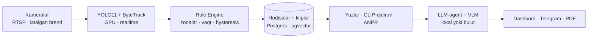

# Pragmata AI — AI Security Copilot

> **«Kamerangdan so'ra»** — *mavjud* kameralaringiz ustidagi AI-tahlilchi (istalgan brend, istalgan RTSP). O'zi kuzatadi, zudlik bilan ogohlantiradi, o'zbek va rus tillarida savollarga javob beradi hamda odamni tavsif bo'yicha soniyalarda topadi.

**🌐 Til:** [English](README.md) · [Русский](README.ru.md) · **O'zbekcha**

Loyiha **President AI Award 2026** uchun (awards.gov.uz). Muddatlar: early bird **15.08.2026**, final **30.09.2026**.

`Python 3.12` · `FastAPI` · `Postgres + pgvector` · `YOLO11` · `InsightFace` · `React 19` · qat'iy CI (`ruff` · `mypy --strict` · 90+ test)

---

## Bu nima

O'zbekistonda millionlab kamera **yozib oladi, lekin hech kim ko'rmaydi**. Bitta qorovul 30–40 ekranni kuzata olmaydi; hodisadan keyin arxivni soatlab qo'lda ko'rib chiqishga to'g'ri keladi. Pragmata — allaqachon o'rnatilgan texnika ustidagi **copilot-qatlam**: kamerani almashtirmasdan, vendor-lok'siz. Biz **kameralarni emas, qaror qabul qilishni** avtomatlashtiramiz.

Butun AI-stek **to'liq obyektda** ishlashi mumkin — video, yuzlar va raqamlar perimetrdan chiqmaydi, LLM/vision modellar lokal ishlaydi, shuning uchun internet o'chirilgan holatda ham ishlaydi. Bu banklar va davlat obyektlarining asosiy savoliga javob.

## Imkoniyatlar

- **Sozlanadigan analitika katalogi — 19 modul**, har bir kamera/zonada yoqiladi: zonaga kirish, qolish, ish vaqtidan tashqari borlik, qurol, xavfli zona, qarovsiz buyum, **avtoraqamlar (ANPR)**, noto'g'ri to'xtash, to'planish, navbat, **issiqlik xaritasi**, **yuzni tanish** (ism bo'yicha kirish/chiqish jurnali), tashrifchilar soni, SHV (kaska/jilet), texnika bo'sh turishi, yuklash zonasi, gigiena (qo'lqop/qalpoq), olov va tutun, qadoq shikasti.
- **Kamerangdan so'ra** — video arxiv bo'yicha **uz/ru** tabiiy tildagi chat/agent (`«Kim kirdi 18:00dan keyin?»`), tiplashtirilgan SQL-first vositalar asosida (model SQL to'qib chiqarmaydi).
- **Tavsif bo'yicha qidiruv** — `«oq ko'ylakli erkak»` → soniyalarda tartiblangan nomzodlar (CLIP), «topilmadi» degan halol javob bilan.
- **Tezkor ogohlantirishlar** — veb-dashbord va Telegramda hodisa kartochkasi: foto, zona, vaqt, klip.
- **PDF tergov dalolatnomalari**, **kechki digest**, **noto'g'ri ishlashlar sikli** — chegaralarni obyektga moslash.
- **Ko'p-ijarali** (qat'iy ma'lumot izolyatsiyasi), **GPU'da real vaqtli aniqlash**, **pragmata.uz** da joylashtirilgan.

## Arxitektura

Hodisaga asoslangan: arzon aniqlash hamma joyda, qimmat AI faqat belgilangan hodisalarda.



- **Rule Engine** — aniq, deterministik qatlam (hysteresis + cooldown + dwell), qora quti emas.
- **VLM** (kadr tavsifi) **faqat** belgilangan hodisalarda, soatlik byudjet bilan ishlaydi.
- **Agent** hech qachon xom SQL yozmaydi — tiplashtirilgan vositalarni chaqiradi (`search_events`, `person_timeline`, `find_person`, …).

## Texnologik stek

| Qatlam | Tanlov |
|---|---|
| Backend | Python 3.12, FastAPI, **sinxron** SQLAlchemy 2.0, Alembic |
| Ma'lumot | Postgres + **pgvector**, halqali buferdan kliplar |
| Ko'rish | YOLO11 / Ultralytics, ByteTrack, **InsightFace**, open_clip (CLIP), **fast-alpr** (ANPR) |
| LLM / VLM | Ollama (lokal, oflayn) **yoki** OpenRouter — bitta OpenAI-mos endpoint |
| GPU | torch + onnxruntime-gpu; `compute_device=auto` (CPU'ga fallback) |
| Frontend | React 19, Vite 7, TypeScript, Tailwind v4, TanStack Query, i18n (uz/ru/en) |
| Yetkazish | Docker, uv (hech qachon pip emas) |

## Muhandislik va xavfsizlik

- **Har bir push'da qat'iy CI:** `ruff` (99-qator), `mypy --strict`, `pytest` (90+ test), OpenAPI kontrakti, golden-set to'liq o'tkazish.
- **Mustahkamlangan autentifikatsiya:** argon2id, JWT, TOTP-2FA, akkaunt bo'yicha brute-force bloklash, security-sarlavhalar, audit-log.
- **PII shifrlash** (Fernet) sezgir maydonlarda; sukut bo'yicha **anonim biometriya** TTL bilan.
- **Ijarachi izolyatsiyasi** testlar bilan tekshirilgan — hodisa va statistika tashkilotlar orasida aralashmaydi.

## Tezkor start (lokal)

Kerak: [uv](https://docs.astral.sh/uv/), Docker, Node 20+. GPU ixtiyoriy (o'zi aniqlanadi).

```bash
# 1. Backend bog'liqliklari (uv — pip EMAS)
uv sync

# 2. Postgres (pgvector) Docker'da
docker compose -f deploy/docker-compose.yml up -d postgres

# 3. Konfig + bazani migratsiyalash
cp .env.example .env      # SECRET_KEY, ENCRYPTION_KEY, ADMIN bootstrap kiritish
make migrate              # yoki: ./scripts/dev_stand.sh (kalitlar + stend generatsiyasi)

# 4. Dashboard API  → http://127.0.0.1:8088/docs
make api

# 5. Kamera pipeline'i (aniqlash + qoidalar + hodisalar)
make pipeline config=config/dev-multi.yaml

# 6. Veb-dashbord (dev)  → http://localhost:5175
make front-dev
```

Birinchi ishga tushirishda modellar (YOLO / CLIP / InsightFace / ALPR) lokal keshga yuklanadi. Testlar: `make test`. To'liq darvozalar: `make lint typecheck test`.

## Repozitoriya tuzilishi

```
pragmata/     backend: pipeline, qoidalar, API, servislar, analitika reestri
  ├─ rules/         deterministik Rule Engine
  ├─ perception/    detektor, yuzni tanish
  ├─ analytics/     19 modulli katalog
  └─ api/           FastAPI-routerlar, security, sxemalar
web/          operator dashbordi (React 19 + Vite)
backoffice/   platforma back-office (alohida Vite-ilova)
alembic/      baza migratsiyalari
config/       kamera/obyekt YAML konfiglari
deploy/       docker-compose (postgres · mediamtx · redis · minio)
docs/         dizayn, vizyon, pitch deck, video ssenariy (uz/ru/en)
tests/        pytest (+ golden-set)
```

## Hujjatlar

- [docs/DESIGN.uz.md](docs/DESIGN.uz.md) · [docs/DESIGN.ru.md](docs/DESIGN.ru.md) — to'liq dizayn-hujjat
- [docs/VISION.uz.md](docs/VISION.uz.md) · [docs/VISION.ru.md](docs/VISION.ru.md) — vizyon va roadmap
- [docs/deck/](docs/deck/) — pitch deck (PDF + tahrirlanadigan manba)

## Litsenziya va jamoa

Proprietar — [LICENSE](LICENSE) ga qarang. © 2026 Pragmata AI jamoasi (Shoxruh Baxtiyorov, Otabek).
**President AI Award 2026** ga topshirilgan. Jonli demo: **[pragmata.uz](https://pragmata.uz)**.
